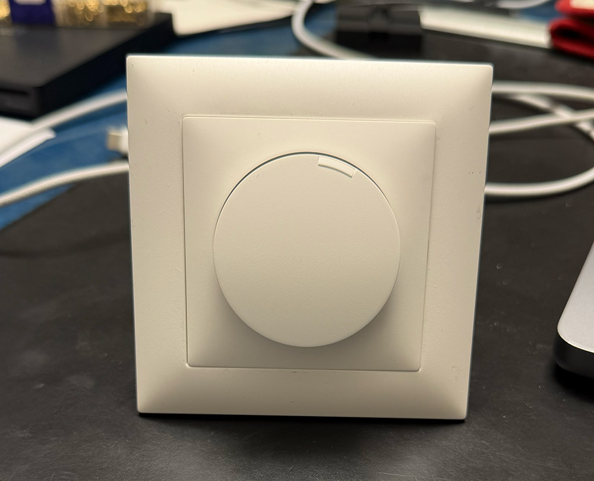
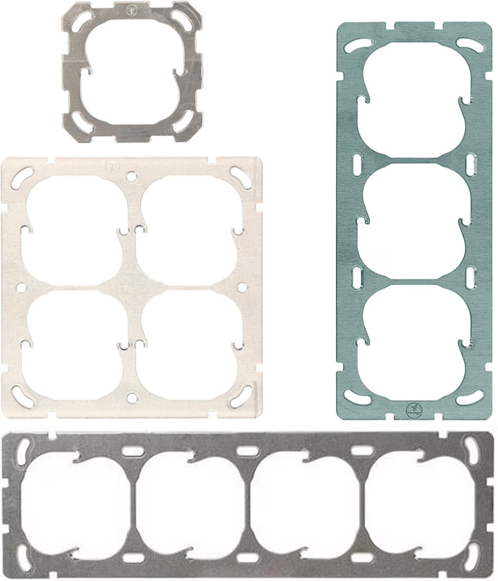
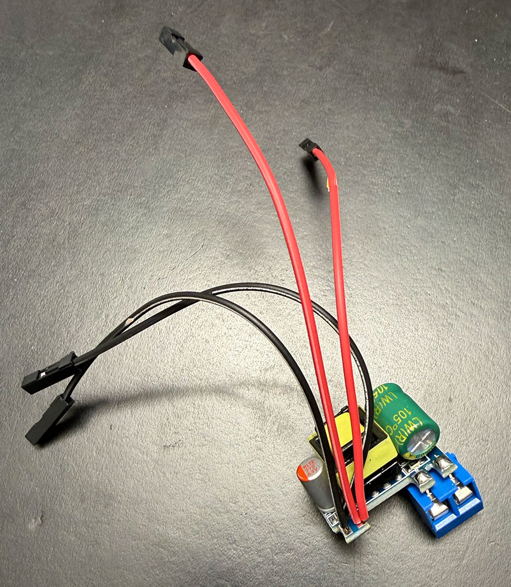
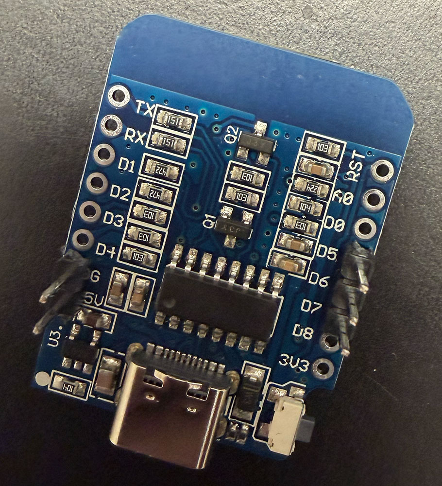
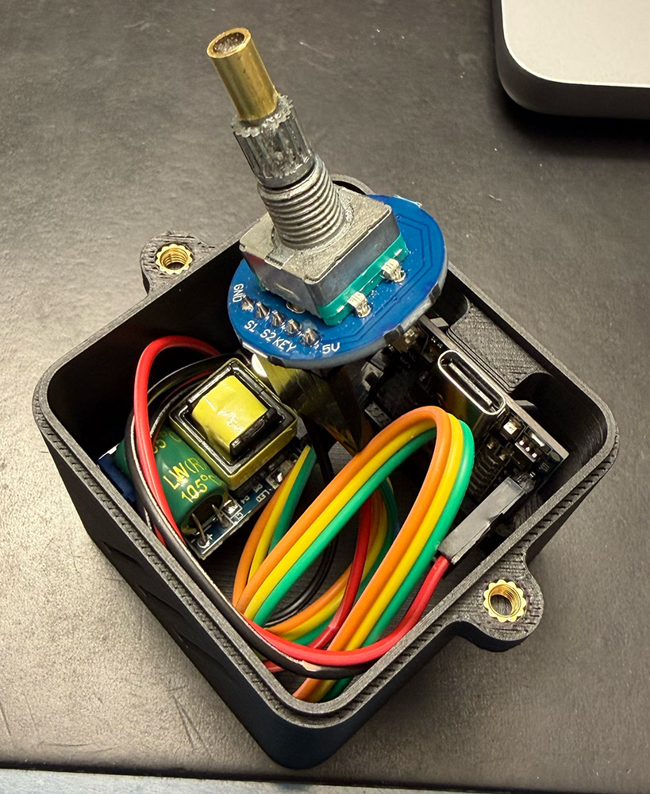
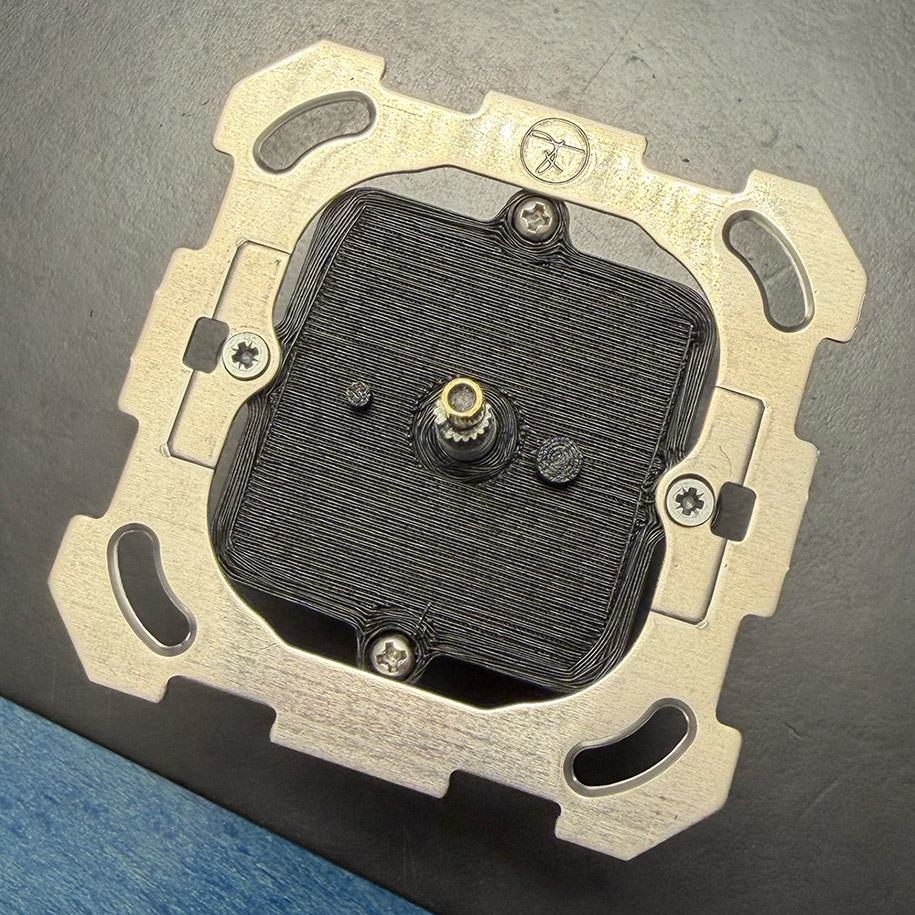
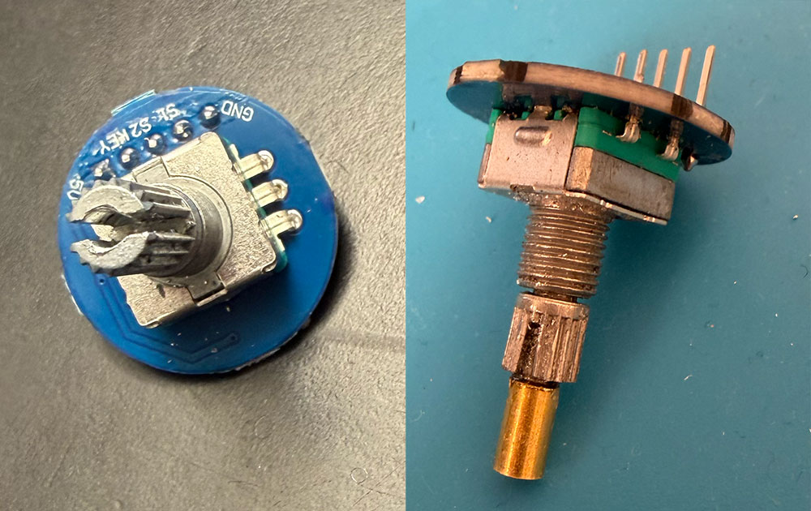
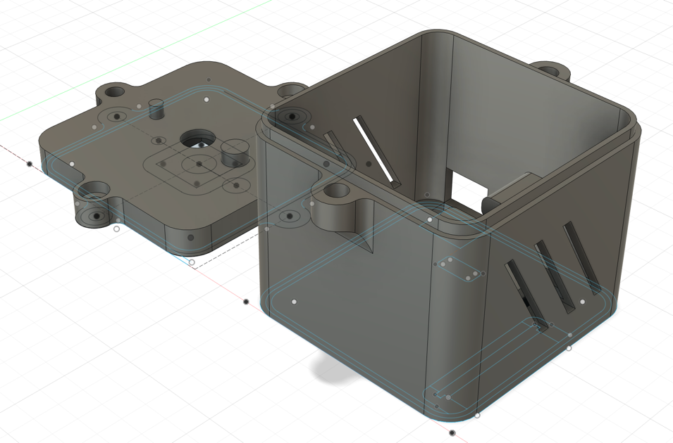

This project provides the hardware to be used behind a Feller universal rotary
dimmer panel that can be integrated into Home Assistant to control anything
you want, single light, arbitrary group of lights, the sound volume of your
amplifier, ... you name it!

<p align="center">
  
</p>


## Context

For more than 100 years, Feller is the leading choice for switches and sockets in
Switzerland. They have been developing timeless designs and durable products.
Their high quality design makes it easy to assemble any combination of switch(es)
and/or sockets in a coherent look, thanks to a unified structure in their numerous
mounting plates, e.g.:

<p align="center">
  
</p>

When it comes to home automation and dimmers, Feller either provides push-buttons
dimmers (with +/- buttons), which are easy to integrate with Home Assistant, or
rotary dimmers, which I found more user-friendly, as they work exactly like a
volume knob and feel more like the analogue world than the digital one.

Unfortunately, Feller only offers rotary dimmers designed for professional or
commercial use, based on
[DALI/DALI-2](https://www.feller.ch/fr/gamme/variateurs-et-regulateurs/variateur-rotatif)
or [KNX](https://www.feller.ch/fr/connected-buildings/knx/capteurs). These are
standardised and robust protocols, but they are rarely used in private homes.

To make up for this, they offer a set of
[four push-buttons compatible with Philips Hue](https://www.feller.ch/fr/gamme/interrupteurs-et-poussoirs/poussoirs-radio),
thus based on ZigBee protocol, but these have several drawbacks:

- piezoelectric operation: no mains power or batteries required, but the buttons
  are much harder to press and make a loud clicking sound;
- amateurish integration into Feller flush-mounted boxes. As they are aimed at
  the general public, the buttons are designed to be stuck to the wall with a
  Feller-style finish, but not integrated into a button panel. To do this, you
  need to purchase the Feller mounting plate, which is only sold to professional
  installers;
- finally, a set of 4 buttons that can be assigned to a +/- function, but
  nothing resembling a volume control button.

For all these reasons, I decided to recreate the physical components of the
Feller dimmer so that I could install it in a similar way within any structure,
whilst retaining the official Edizio Due look (Feller's modern design).

ESPHome makes it easy to use a
[rotary encoder](https://esphome.io/components/sensor/rotary_encoder/), and
even supports the "push" function, allowing you to both turn the dial to
adjust the brightness and press the button to switch the device on or off.


## Hardware

- 1x Feller EdizioDue rotary dimmer front panel, e.g., from [Galaxus](https://www.galaxus.ch/en/s4/product/feller-ediziodue-rotary-dimmer-front-panel-light-switches-plug-sockets-11951288)
- 1x Rotary Encoder Module from [Shenzhen BaoXin Electronic Store](https://de.aliexpress.com/item/1005006105510076.html)
- 1x Mini AC 230V to DC 5V [Converter PCB Board](https://de.aliexpress.com/item/1005007611343097.html)
- 1× WeMos D1 Mini TYPE-C ESP8266 ESP-12F
- 1x Straight pin PCB screw terminal block connector [KF301-2P](https://www.temu.com/goods.html?goods_id=601099519858573)
- Dupont Wires Female to Female, e.g., from [Temu](https://www.temu.com/goods.html?goods_id=601099677318410)
- 4× Threaded inserts M3 (2×3mm height, 2×4mm height)
- 2× Cross round Phillips pan head screw bolt M3, length 6mm


## Wiring

| Wire   | Converter | ESP8266        | Rotary Encoder |
|--------|-----------|----------------|----------------|
| Red    | Out + VCC | 5V (VIN)       | 5V (VIN)       |
| Black  | Out - GND | Ground (G/GRN) | Ground (GND)   |
| Green  |           | D7 - GPIO13    | Key            |
| Yellow |           | D6 - GPIO12    | S2 / Clock     |
| Orange |           | D5 - GPIO14    | S1 / DT        |

<p align="center">
  
  <br>
  
  
</p>

The trickiest part was to convert the 6 mm shaft of the rotary encoder to a
4 mm shaft required for the Feller front plate. I drilled a hole in the 6 mm
shaft and tapped it with an M3 thread, screwed a piece of threaded rod into it
(which I also glued in place), and finally fitted a 4 mm diameter brass ferrule:

<p align="center">
  
</p>

**Hint:** the total height from the base plate (without the mounting screw)
is about 11 mm, with 6-7 mm length of the 4 mm diameter shaft. The hardware is
easily found in a DIY store such as Bauhaus.


## Code

```yaml
esphome:
  name: feller-dimmer
  friendly_name: feller-dimmer

esp8266:
  board: esp01_1m

# Enable logging
logger:

# Enable Home Assistant API
api:
  encryption:
    key: "--redacted--"

ota:
  - platform: esphome
    password: "--redacted--"

wifi:
  ssid: !secret wifi_ssid
  password: !secret wifi_password
  min_auth_mode: WPA

  # Enable fallback hotspot (captive portal) in case wifi connection fails
  ap:
    ssid: "Feller-Dimmer Fallback Hotspot"
    password: "--redacted--"

captive_portal:

binary_sensor:
  - platform: gpio
    pin:
      number: GPIO13
      mode: INPUT_PULLUP
      inverted: true
    name: "Power Switch Button"

sensor:
  - platform: rotary_encoder
    name: "Rotary Encoder"
    pin_a:
      number: GPIO14
      mode: INPUT
    pin_b:
      number: GPIO12
      mode: INPUT
    max_value: 100
    min_value: 0
    resolution: 4
```


## 3D-Printed Enclosure

<p align="center">
   
</p>

I designed the enclosure in Autodesk Fusion. STL file
[feller-dimmer.stl](feller-dimmer.stl) contains everything you need.

It may be useful to print the drilling-guide. STL file
[drilling-guide.stl](drilling-guide.stl) is a two-part drilling guide. Start
with both parts mounted together, drill a hole using a 2.5mm drill bit. Then
remove the top part and use an M3 drill bit to tap a thread.


## Disclaimer

Using this component requires you to connect consumer electronics inside your
walls. There's 240V in that box, so please make sure you know what your doing.

This code was tested by trial and error, it might blow a fuse or two.
Connecting this to your electricity network is your own responsibility. You are
advised to ask a professional electrical installers to connect the device to
your home.
